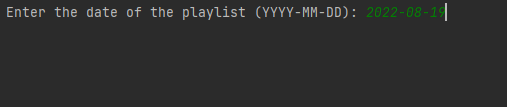
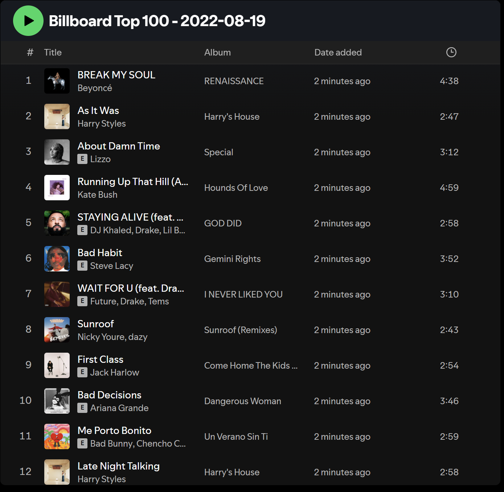

# Spotify Billboard Playlist Creator

## Overview

This program creates a Spotify playlist of the Billboard Top 100 songs for a specific date (from the year 2000 onward) and adds it to the user's Spotify account. It uses BeautifulSoup to scrape the Billboard charts and Spotipy to interact with the Spotify API.

## Features

- Scrapes the Billboard Top 100 songs and their artists for a specified date.
- Authenticates with Spotify using user-provided credentials.
- Searches Spotify for the corresponding tracks and adds them to a new playlist in the user's account.

## Screenshots

### Input Prompt


### Playlist Created



## Tools and Technologies

- **Python 3.9+**
- **BeautifulSoup** for web scraping
- **Spotipy** for Spotify API integration

## Prerequisites

- A **Spotify Developer Account** to create an app and generate the required credentials.
- Python packages: `requests`, `beautifulsoup4`, and `spotipy`.

## Installation

1. Clone the repository:
   ```bash
   git clone https://github.com/your-username/spotify-billboard-playlist.git
   ```
2. Navigate to the project directory:
   ```bash
   cd spotify-billboard-playlist
   ```
3. Install the required packages:
   ```bash
   pip install -r requirements.txt
   ```

## Setup

1. **Create Spotify Credentials**:
   - Log in to your [Spotify Developer Dashboard](https://developer.spotify.com/dashboard/).
   - Create a new app and note the **Client ID** and **Client Secret**.

2. **Set Environment Variables**:
   - Add your Spotify credentials as environment variables:
     ```bash
     export SPOTIFY_ID='your_client_id'
     export SPOTIFY_SECRET='your_client_secret'
     ```
   - On Windows, use:
     ```cmd
     set SPOTIFY_ID=your_client_id
     set SPOTIFY_SECRET=your_client_secret
     ```

## How to Run

1. Run the script:
   ```bash
   python main.py
   ```
2. Enter the date for the playlist in `YYYY-MM-DD` format when prompted.
3. The program will authenticate your Spotify account, scrape the Billboard Top 100 for the specified date, and create a private playlist in your Spotify account.

## Notes

- The script only supports dates from the year 2000 onward.
- Ensure that your Spotify account is set up to allow private playlist creation.
- Some songs might not be found on Spotify due to regional or licensing restrictions.

## Contributing

Contributions are welcome! Feel free to fork the repository and submit pull requests.

## License

This project is licensed under the MIT License.

---

Enjoy curating your playlists with **Spotify Billboard Playlist Creator**!
